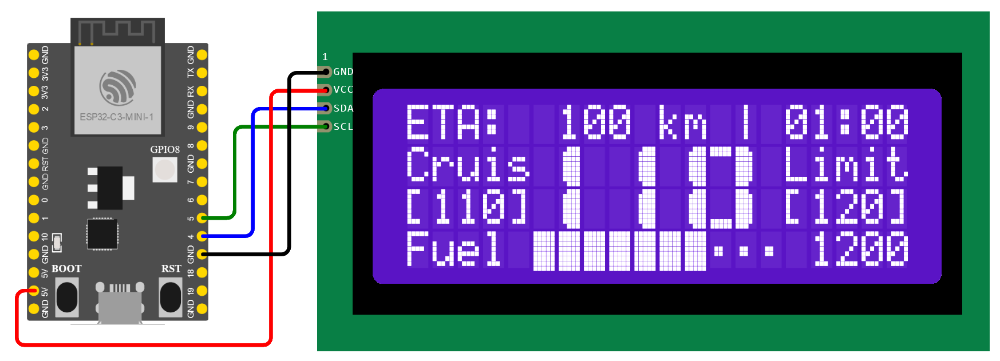

# ETS2 LCD Dashboard

ETS2 LCD dashboard is a client of [ETS2 Telemetry Web Server](https://github.com/Funbit/ets2-telemetry-server) made with ESP8266 / ESP32-C3. It can connect to the telemetry server via Wi-Fi, work as a wireless digital dashboard for your ETS2/ATS trucks. Theoretically, the code should be able to port to any MCU boards with integrated Wi-Fi support (such as Raspberry Pi Pico W, other ESP32 series boards).



The dashboard can display:

- Estimated distance and time,
- Current speed, cruise control speed and speed limit (kph/mph),
- Fuel and estimated fuel distance,
- Time and date (sync with NTP).

Check this video to see how it looks in action:

[](https://www.youtube.com/watch?v=SX45oxnS2IU)

## Hardware

The prices listed below are the retail prices I purchased in China in October 2023, only for reference.

| Part                                     | Price                         |
| ---------------------------------------- | ----------------------------- |
| LuatOS ESP32C3-CORE development board    | CNY 9.9 (with free shipping)  |
| LCD 2004 (20x4) with I2C daughter board  | CNY 12.7 (with free shipping) |
| 40pcs female to female jumper wires      | CNY 2 (with free shipping)    |
| LCD 2004 acrylic display case (optional) | CNY 2.8 + CNY 2 shipping fee  |
|                                          | Total: CNY 29.4 (USD 4.2)     |

Pin connections:

| LCD 2004 I2C                                             | ESP8266 / ESP32-C3 |
| -------------------------------------------------------- | ------------------ |
| `VCC`                                                    | `VBUS`             |
| `GND`                                                    | `GND`              |
| `SDA`                                                    | `GPIO4`            |
| `SCL`                                                    | `GPIO5`            |
| `LED` (optional, refer the "Adaptive Backlight" section) | `GPIO2`            |

## Configuration

The Wi-Fi information and ETS2 telemetry web server address are hardcoded in `config.h`. You will need to update below lines to match your configuration (make sure to assign a static IPv4 address to your PC):

```cpp
// Wi-Fi and API server
constexpr const char *SSID = "YOUR WIFI SSID";
constexpr const char *PASSWORD = "YOUR WIFI PASSWORD";
constexpr const char *ETS_API = "http://YOUR_PC_IP:25555/api/ets2/telemetry";
```

Setup NTP server, your local time zone and daylight saving time if you enabled the clock feature (need Internet access):

```cpp
// Clock settings
constexpr bool CLOCK_ENABLE = true;                 // false to disable the clock feature
constexpr const char *NTP_SERVER = "pool.ntp.org";  // "ntp.ntsc.ac.cn" for mainland China
constexpr int TIME_ZONE = 8 * 60;                   // local time zone in minutes
constexpr bool DST = false;                         // daylight saving time
```

> ℹ The clock will sync with NTP server every hour to keep accurate time. Choose the fastest server to speedup the initial sync:
>
> - Mainland China: `ntp.ntsc.ac.cn`
> - Other regions: `pool.ntp.org`
>
> If you don't want the dashboard access the Internet, set `CLOCK_ENABLE` to `false` to completely disable the clock feature.

In most case, the default I2C address of LCD 2004 should be `0x27`. But if you cannot get the LCD work, try to change the address in `board.h` to `0x3F` (PCF8574AT).

```cpp
// 2004 LCD PCF8574 I2C address
constexpr int LCD_ADDR = 0x27;
```

More dashboard features could be customized with below settings (`config.h`):

```cpp
// Dashboard configurations
constexpr bool CLOCK_BLINK = true;  // blink the ":" mark in dashboard clock
constexpr bool CLOCK_12H = true;    // display dashboard clock in 12 hour
constexpr bool SHOW_MILE = false;   // display with mile instead of km
```

## Build and Upload

The project is an Arduino IDE Sketch. You will need to add ESP32-C3 board support first:

1. Install Arduino IDE: https://www.arduino.cc/en/software/
2. Add board manager URL: https://dl.espressif.com/dl/package_esp32_index.json
3. Install `esp32` by Espressif Systems from board manager.

Then install below libraries:

- `ArduinHttpClient` by Arduino
- `Arduino_JSON` by Arduino
- `LiquidCrystal I2C` by Frank de Brabander
- `NTPClient` by Fabrice Weinberg
- `SoftwareTimer` by ILoveMemes
- `Time` by Michael Margolis

To build and upload the firmware:

 1. Connect your ESP32C3 board with USB cable.

 2. Choose board: `esp32 / ESP32C3 Dev Module` (or the type specified by your vendor)

    > ⚠ For LuatOS ESP32C3-CORE board, the flash mode must be set to `DIO`.

 3. Open the `ets2_lcd_dashboard` folder, click "Upload" button to build and upload.

It is highly recommended to open the "Serial Monitor" (`921600` baud) in Arduino IDE for troubleshooting during the first run.

## Adaptive Backlight

By default, the backlight of 2004 I2C LCD can only be set to on or off. To let the firmware control the backlight brightness, the jumper on the I2C daughter board should be removed, and the top jumper pin (labeled with `LED`) should be connected to `GPIO2`. Then the backlight will be controlled as below:

- Dashboard mode:
  - Completely off when the truck engine is stopped;
  - Dimmer when headlight is on (for night).
- Clock mode:
  - Dimmer as night light (1:00am ~ 5:59am by default).

All the backlight levels could be customized with below settings, values from `0` to `255` (100%):

```cpp
// Backlight levels for dashboard
constexpr int BACKLIGHT_DAY = 200;    // for daytime, brighter
constexpr int BACKLIGHT_NIGHT = 128;  // when headlight on, dimmer

// Backlight levels for clock
constexpr int BACKLIGHT_CLOCK = 128;     // normal time
constexpr int BACKLIGHT_CLOCK_DIM = 24;  // night light

// Hours to dim the clock (1:00am ~ 5:59am by default)
static constexpr bool CLOCK_DIM_HOURS[24] = { ... };
```

## Release History

**2024-7-6**

- Display "Batt" instead of "Fuel" for Renault E-Tech T and Scania S BEV;
- Fuel warning.

**2024-7-3**

- ESP8266 support;
- Changed LED pin from `GPIO6` to `GPIO2` to compatible with ESP8266;
- 12/24 hour dashboard clock format switch (`CLOCK_12H`).

**2024-2-11**

- Adaptive backlight.

**2024-1-26**

- Full screen clock when not driving;
- Kilometer/mile switch (`SHOW_MILE`);
- Speeding warning.

**2023-11-26**

- Initial release.

## External links

Forums

- [Discussion on the official SCS forum](https://forum.scssoft.com/viewtopic.php?p=1881413)

Tutorial

- [给美卡模拟/欧卡模拟2手工撸个硬件行车电脑 (Chinese)](https://post.smzdm.com/p/al8ee28e/)
